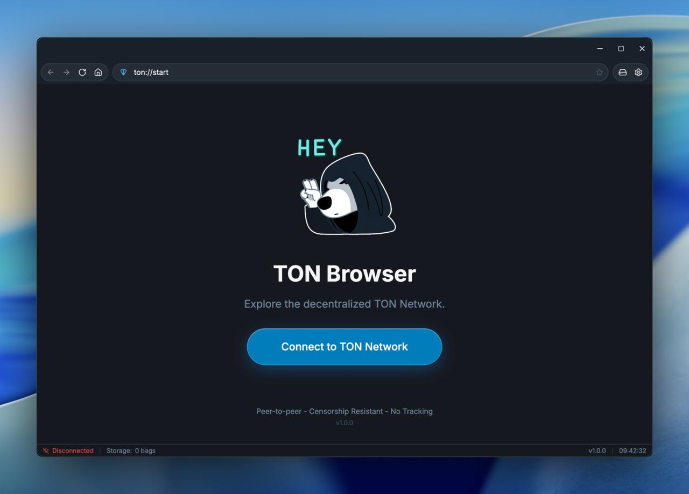
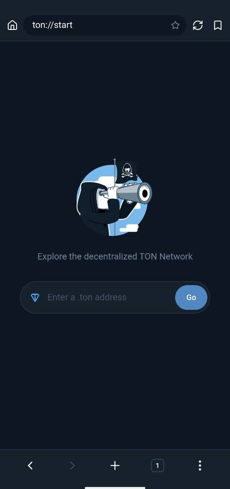
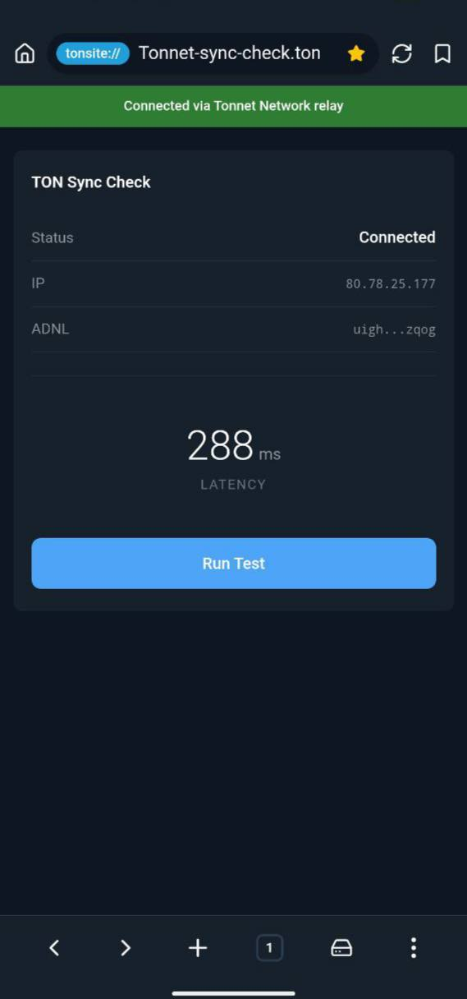
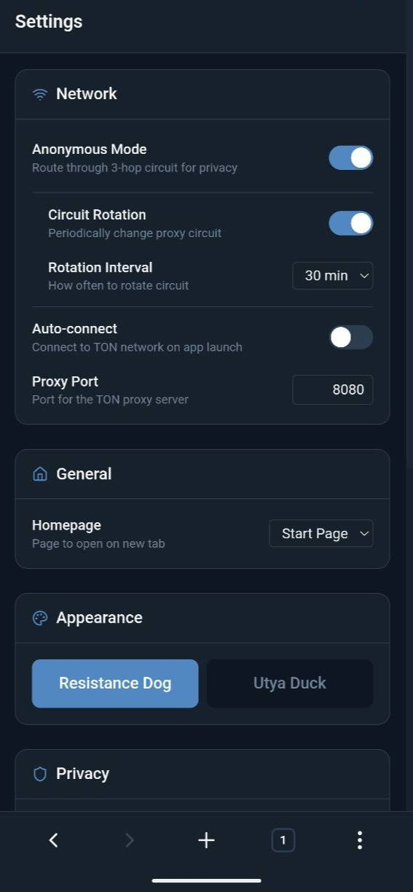

<h1 align="center">Tonnet Browser Mobile</h1>

<p align="center">
  <strong>The TON Network Browser for Android</strong>
</p>

<p align="center">
  <a href="#about">About</a> •
  <a href="#features">Features</a> •
  <a href="#installation">Installation</a> •
  <a href="#usage">Usage</a> •
  <a href="#faq">FAQ</a> •
  <a href="#contributing">Contributing</a> •
  <a href="#contact">Contact</a>
</p>

<p align="center">
  <a href="https://tonnet.resistance.dog"></a>
  
  
  
</p>

<h3 align="center">Download</h3>

<p align="center">
  <a href="https://github.com/TONresistor/tonnet-mobile-dev/releases/latest/download/tonnet-browser-v1.0.1.apk">
    
  </a>
</p>

<p align="center">
  <sub>
    <a href="https://github.com/TONresistor/tonnet-mobile-dev/releases">All releases</a> ·
    <a href="https://github.com/TONresistor/tonnet-browser-dev">Desktop version</a>
  </sub>
</p>

---

<table>
  <tr>
    <td align="center"><br><em>Home</em></td>
    <td align="center"><br><em>Start</em></td>
    <td align="center"><br><em>Browser</em></td>
    <td align="center"><br><em>Settings</em></td>
  </tr>
</table>

## About

Tonnet Browser Mobile is a native Android browser with a built-in TON proxy, providing peer-to-peer access to the TON Network. Your device connects to TON sites either directly or through multi-hop garlic routing when anonymous mode is enabled. Uncensored & unstoppable.

Tonnet Browser combines the anonymity model of Tor with multi-hop garlic routing, the peer-to-peer architecture of BitTorrent for decentralized content delivery, and a blockchain layer for cryptographic DNS resolution and TON payments. Domain resolution for `.ton` and `.t.me` happens on-chain through TON DNS, while traffic flows between your device and TON nodes using the RLDP protocol over ADNL. Enable anonymous mode to route your connection through a 3-hop encrypted circuit where no single relay knows both your origin and destination.

## Features

- Native `.ton`, `.adnl` and `.t.me` domain browsing
- Anonymous mode: 3-hop garlic circuit
- Decentralized DNS resolution via TON blockchain
- Auto-append `.ton` to URLs without TLD
- Multi-tab browsing with tab management
- Bookmarks with quick access
- Privacy focused & lightweight
- Native Android experience

## Installation

### Android

> **Download:** [APK](https://github.com/TONresistor/tonnet-mobile-dev/releases/latest/download/tonnet-browser-v1.0.1.apk)

1. Download the APK file
2. Enable "Install from unknown sources" in your device settings
3. Open the APK and tap Install
4. Launch Tonnet Browser

**Requirements:** Android 9.0 (API 28) or higher

## Usage

1. Launch Tonnet Browser
2. Tap **"Connect to TON Network"**
3. Wait for sync to complete
4. Enter a `.ton` address in the URL bar (e.g., `foundation.ton`)
5. Browse the decentralized web

**Tip:** Just type `foundation` - the app automatically adds `.ton` for you.

## Settings

Access settings via the gear icon in the bottom navigation.

| Category | Settings |
|----------|----------|
| **General** | Homepage, Auto-connect |
| **Privacy** | Anonymous mode, Clear browsing data, Clear on exit |
| **Appearance** | Theme (Default, Utya Duck) |

## FAQ

<details>
<summary><strong>What is garlic routing?</strong></summary>

Garlic routing encrypts your traffic in multiple layers and routes it through 3 independent relays. Each relay only knows its immediate neighbors, never the full path or your identity.
</details>

<details>
<summary><strong>What .ton sites can I visit?</strong></summary>

Try `foundation.ton`, `ton.ton`, or `dns.ton`. More sites are listed on [ton.app](https://ton.app).
</details>

<details>
<summary><strong>Is my traffic anonymous by default?</strong></summary>

No. By default, Tonnet connects directly for faster browsing. Enable Anonymous Mode in settings to route traffic through the garlic circuit.
</details>

<details>
<summary><strong>Why is the APK not signed?</strong></summary>

This is an open-source development build. You may see a warning when installing. The source code is fully auditable.
</details>

## Building

### Prerequisites

- Node.js 22+
- npm 9+
- Android SDK
- Java 21

### Development

```bash
git clone https://github.com/TONresistor/tonnet-mobile-dev.git
cd tonnet-mobile-dev
npm install
npm run dev
```

### Production Build

```bash
npm run build
npx cap sync android
cd android && ./gradlew assembleRelease
```

APK is output to `android/app/build/outputs/apk/release/`.

### Tests

```bash
npm run test:run
```

## Tech Stack

| Component | Technology |
|-----------|------------|
| Framework | Capacitor 8 |
| Frontend | React 19, TypeScript 5.9 |
| Styling | Tailwind CSS 4 |
| State | Zustand |
| Build | Vite 7 |
| Testing | Vitest |
| TON Proxy | [tonutils-proxy](https://github.com/xssnick/tonutils-proxy) |
| Transport | RLDP over ADNL over UDP |

## Contributing

Contributions are welcome! Here's how to get started:

1. **Open an issue first** — Discuss your idea before writing code
2. **Fork the repository** — Create your own copy
3. **Create a feature branch** — `git checkout -b feature/your-feature`
4. **Make your changes** — Follow existing code style
5. **Submit a pull request** — Reference the related issue

## Contact

- **Website** — [tonnet.resistance.dog](https://tonnet.resistance.dog)
- **Telegram** — [@zkproof](https://t.me/zkproof)
- **Issues** — [Report bugs or request features](https://github.com/TONresistor/tonnet-mobile-dev/issues)
- **Desktop version** — [tonnet-browser-dev](https://github.com/TONresistor/tonnet-browser-dev)

## License

MIT License. See [LICENSE](LICENSE) for details.

## Acknowledgments

- [Tonnet Browser](https://github.com/TONresistor/tonnet-browser-dev) - Desktop version
- [tonutils-go](https://github.com/xssnick/tonutils-go) - TON protocol implementation
- [tonutils-proxy](https://github.com/xssnick/tonutils-proxy) - HTTP proxy for TON sites
